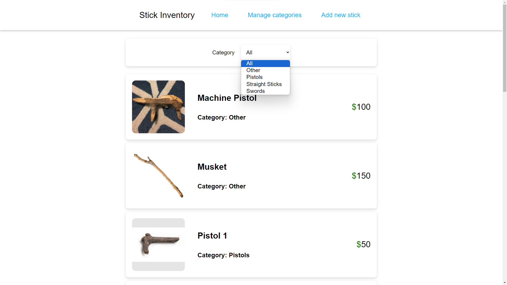
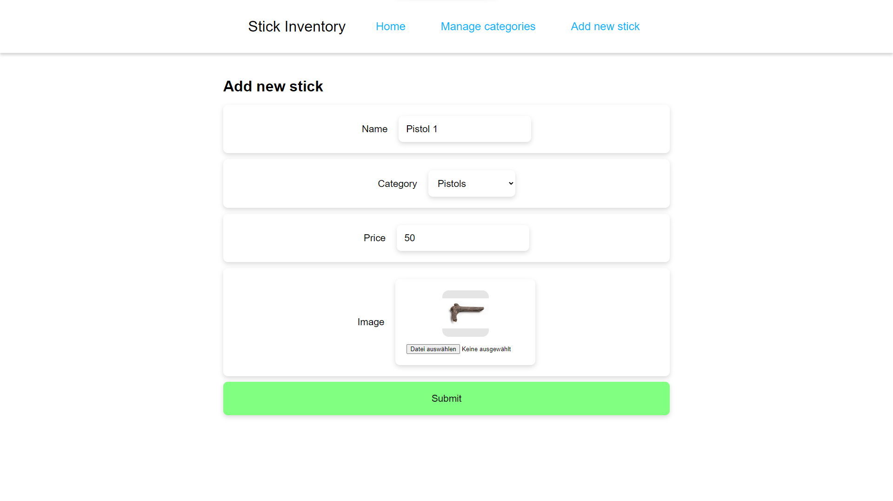
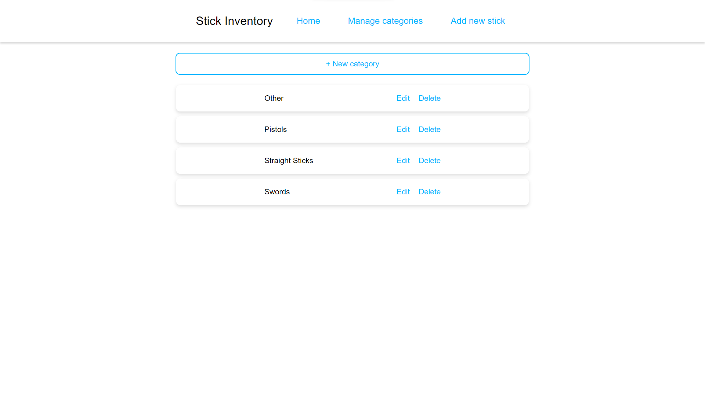

# TOP-inventory-application

My implementation of [The Odin Project's](https://www.theodinproject.com/) inventory application project.

Needs the environment variables `MONGODB_URI` and `DB_NAME` to work properly.

## Screenshots

### Stick list / home page

### Stick form

### Manage categories

